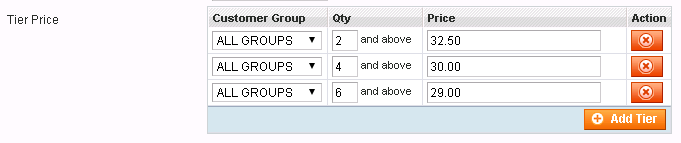

**Everest eCommerce Connector User Guide**

Everest Software Inc.

401 Congress Avenue

Suite 2650

Austin, Texas USA 78701

Copyright © 2008–2016.  Everest Software, Inc. ("Everest"). All Rights Reserved. These materials and all Everest products are copyrighted and all rights are reserved by Everest.

This document is proprietary and confidential to Everest and is available only under a valid non-disclosure agreement. No part of this document may be disclosed in any manner to a third party without the prior written consent of Everest. The information in these materials is for informational purposes only and Everest assumes no responsibility for any errors that may appear therein.  Everest reserves the right to revise this information and to make changes from time to time to the content hereof without obligation of Everest to notify any person of such revisions or changes.

Everest is a registered trademark of Everest Software, Inc., in the U.S. and other countries. Additional Everest trademarks or registered trademarks are available at: [http://www.versata.com/legal](http://www.versata.com/legal).

All other marks contained herein are for informational purposes only and may be trademarks of their respective owners.

**Everest eCommerce Connector User Guide**

Version: 7.1.0

**May 2017**

**Table of contents**

[[TOC]]

# **1 Introduction**

This user guide provides all information needed for operating Everest eCommerce Connector successfully. Everest eCommerce Connector  is a windows service application intended for Magento. This chapter provides supported ecommerce solutions details, prerequisites, and an overview of the product. 

## **1.1 ****Supported eCommerce solutions**

Magento Community Edition 1.9.2.4 running PHP 5.6

## **1.2 ****Requirements for the Connector**

* Windows Server 2008 R2 or later

    * .NET 4.5

* PHP 5.6 and effective settings:

    * memory_limit 2048M

    * post_max_size 100M

    * upload_max_filesize 20M

    * max_execution_time 1800

    * extension=php_exif.dll

## **1.3 ****Overview**

The core of the Everest eCommerce Connector is the Connector Service (hereafter simply  "Connector") which is the windows service application. It is responsible for listening to events from both sides - Everest system and eCommerce solution. The events include orders submission at eCommerce side, items modifications at Everest side, and similar. Upon receiving an event, the Connector executes sequence of tasks to keep eCommerce and Everest system synchronized.

Connector relies on the HTTP subsystem available in the Windows Server operating system and  listens on specific endpoints for events. Events are transferred in the form of HTTP requests.

In order to work  the whole system properly, Everest system and eCommerce solution must be configured. In particular, an extension for the Everest system needs to be installed and configured on the same machine where Everest Server is running. The same should be done for the eCommerce solution as well.

 (ERROR: Paragraph 93 of type PARAGRAPH has an unsupported child: INLINE_DRAWING  index=93)

# **2 ****Installation**

The Connector needs to be installed on the machine which has Everest Server and Everest SDK installed. The Connector package is distributed as standalone archive named as eComConnector-<**VER**>-<**DATE**>-<**REV**>.zip, where:

<table>
  <tr>
    <td>Format</td>
    <td>Stands for</td>
  </tr>
  <tr>
    <td>VER</td>
    <td>Everest product version with which the Connector is compatible</td>
  </tr>
  <tr>
    <td>DATE </td>
    <td>build date</td>
  </tr>
  <tr>
    <td>REV</td>
    <td>build revision</td>
  </tr>
</table>

For example: **eComConnector-6.33.0-2014-10-10-59602.zip**

Installation needs to be completed in the following order:

1. Install Connector Service

2. Install extension for Everest system

3. Install extension for Magento

4. Configure Everest system

Before proceeding with each component installation, unpack the archive into c:\eComConnector folder. In this folder you can find the following subfolders:

* *ConnectorService* - contains Connector Service binaries

* *EverestExtensions/Magento* - contains extension for Everest system

* *eComExtensions/Magento* - contains extension for Magento

## **2.1 ****Everest configuration**

The Connector expects Everest system to be preconfigured for the whole system to work properly. The following needs to be configured (more details on each item below):

1. [Sales Order and Sales Invoice aliases](#heading=h.lcoclsvzanu4)

2. [Shipping item code](#heading=h.kx17q0utsdtl)

3. [Delivery method](#heading=h.wxv2i7w0sjo3)

4. [Payment method](#heading=h.wxv2i7w0sjo3)

5. [Payment terms](#heading=h.zdhxubew9y68)

6. [Magento Guest Account](#heading=h.hmvhowoqaoey)

### **_2.1.1 _****_Sales Documents Aliases_**

Sales documents in Everest system have a predefined transition path: **_Sales Quote > Sales Order > Sales Invoice_**. Each document type can have as many aliases as needed. This is especially useful when there is a need to distinguish documents within the same type. Here you need to distinguish *Sales Order* (SO) and *Sales Invoice *(SI) created in the scope of Magento integration from those created by Everest users. Thus aliases for Sales Order and Sales Invoice must be created in Everest.

Aliases can be created at **File > Setup > Miscellaneous > Document Aliases**. Created aliases need to be specified in the Connector configuration file. By default Connector expects ‘Magento Order’ and ‘Magento Invoice’ to be aliases for *Sales Order* and *Sales Invoice* correspondingly. Thus it is recommended to create same aliases. Also note that during Sales Order alias creation there is an option to specify Final Document. It is important to make ‘Magento Invoice’ as the final document.

#### **2.1.1.1 ****How it works**

The Connector creates an SO in Everest system using the SO alias specified in the Connector’s configuration file when a new order is placed in the Magento. Thus that alias must already exist in Everest system. By default Connector uses ‘Magento Order’ as the alias for SO. This can be changed in the configuration file available in  *MagentoWebsites/MagentoWebSite/source@SOAlias*). The created SO gets Reference field assigned to Magento order ID. 

**Note**: Do not edit Reference field of Sale Order as in this case synchronization could fail when Sales Order converted into Sales Invoice.

When SO is converted to SI and saved, the Everest extension checks the alias of SI and if the alias matches the one specified in the SIAlias attribute (of the Connector configuration file) then the SI is treated as created in the scope of Magento integration. In that case Connector executes the SI synchronization process (note that the Reference field of the SI is copied from the SO and used to link the SI and the Magento order). By default the Connector expects Magento related Sales Invoices to have ‘Magento Invoice’ alias. This can be changed in the configuration file available in  *MagentoWebsites/MagentoWebSite/source@SIAlias*.

### **_2.1.2 _****_Shipping Item_**

When a Magento order is created, it contains shipping charges. When the Connector syncs that order to the SO in Everest system, the shipping charges added as an item to the SO.The item code which is used for that can be configured via Everest Client eCommerce settings: 

**Steps for Item code settings**

1. Go to **File > Setup > E-Commerce > Preferences**.

2. Double click the website profile to see details. If there are multiple profiles, you should use  the one which is specified in the Connector config file. 

3. Navigate to **Settings > Freight **tab and specify item code in **Item used to hold shipping charges for the document**.

### **_2.1.3 _****_Delivery Method_**

There are multiple delivery methods configured in Magento with unique code (unique ID). The end user will specify a method during checkout and Magento sends the unique ID of the selected delivery method to the connector.  In turn, Connector also uses the same ID while creating SO in Everest system. Thus  the delivery method with the code must be available in Everest system as well.

For example Flat Rate delivery method in Magento has code **flatrate_flatrate** and delivery method with the same code needs to be created in Everest, otherwise Connector would fail to create SO. In Everest system, the delivery method can be created at **File > Setup > Freight > Delivery Methods**. 

### **_2.1.4 _****_Payment method and mapping_**

The Connector sends details of the SI to Magento when Everest system user converts SO to SI and saves it. In turn Magento generates invoice as well as shipping document if necessary. Shipping document is generated only if the shipping charge is included in the SI. Afterwards Magento charges customer’s credit card and replies to the Connector with the transaction details and payment method which was used at Magento. Connector generates receipt for the SI using the following:

* *Payment method code* - Payment Methods Mapping (see below) is used to get Everest Payment Method by Magento’s payment method and credit card type

* *Amount* - used one returned from Magento (must be equals to SI totals)

* *Approval code* - used Transaction ID returned from Magento (if payment is done using credit/debit card)

* *Reference No* - reference information returned from Magento (last 4 digits of the card if payment is done using credit/debit card)

#### 2.1.4.1 Payment method mapping

In order to match Magento payment method with Everest payment method there is **PaymentMethodMapping** section if configuration file. This is an example of the section:

Each mapping is set in **<map />** section, which has 2 attributes:

1. magentoPaymentSignature - for credit card payments it is a pair of ‘payment method’ and ‘credit card type’ splitted by a colon

2. everestPaymentMethodCode - is the code of a corresponding payment method in Everest

**_Note_****:**** ** 

1. Only Payflow Pro payment processor supported in Magento and **verisign** is its payment method code.

2. Customer may select to pay using payment terms (the choice will be shown if applicable for the customer)

3. On the Everest side the payment method must be one of the following types:

* DEBIT/CREDIT CARD type and Other card types.

* OTHERS type

4. Close the SI in Everest system and reopen to view the Receipt.

5. **TransferAuthorization **attribute of **paymentMethodMapping **config section is described in [11.5.3 Option to take payment in Everest on Sales Order (EVCID-4177)](#heading=h.s3hqn48cmbkq)

### *2.1.5 Payment terms*

In case a customer is eligible to pay using payment terms (like N10, N30) then during checkout process in addition to credit card payment option the customer will see option to pay using terms.

If payment terms is selected during checkout process at Magento then SO created in Everest will have Terms field initialized accordingly. In case the customer choose to pay by credit card then Terms field will be set to the value specified by the **MagentoPaymentMethodTerm** option in Connector configuration file.

### *2.1.6 Magento Guest Account*

When guest user (not logged in user) goes through checkout process in Magento, it sends quote request to Everest, which, in turn, requires a customer account in Everest to perform some calculations (taxes, discounts, etc).

To create Magento Guest Account:

1. Open Everest Client and login

2. Go to menu **Invoicing **> **Customers**

3. Click **New **> **In New Window**

4. Fill in

    1. Account code = "MAGENTO_GUEST"

    2. Account name = "Magento Guest Account"

    3. First name = "Magento"

    4. Last name = "Guest"

    5. Zip/Postal code = any valid zip code, for example "20101"

    6. E-mail ID = "mg@example.com"

5. Click **Save and Close**

You can use Connector’s configuration to configure account code to be used as Magento Guest Account:

## **2.2 ****Connector service**

Binaries for the Connector service are located in the *ConnectorService* folder. Execute **InstallConnectorService.cmd** to install the service. This will configure necessary permissions for the service and install the service. Executing **UninstallConnectorService**.cmd will uninstall the service.

By default the service listens on the following two endpoints:

* [http://127.0.0.1:7001](http://127.0.0.1:7001) - Everest extension send events to this endpoint

* http://*:7000 - eCommerce extension send events to this endpoint

**Note**: 

1. Please make sure that your firewall is not blocking eCommerce sink port (7000 by default).

2. By default service is configured to run under NT AUTHORITY\NETWORK SERVICE built in account, make sure that account can access Everest COM+ application (COM Security on the Everest Server machine should grant NT AUTHORITY\NETWORK SERVICE account Access, Launch and Activation permissions)

### **_2.2.1 _****_Configuring Connector_**

**Configuration for the Connector located in the eComConnector.Service.exe.config file**

Connector reads **eComConnector** section to get the configuration details:

* **connectionStringName** - attribute of the **eComConnector** section which specifies the connection string for the Connector to use to connect to the database to keep its own settings. See [10.4.3 Database for Connector (EVCID-4113)](#heading=h.i2tyw5b5zifo) section for more details

* **general** tag - configures endpoints the service listens on

    * **everestSink** tag, **url** attribute  - specifies endpoint for Everest System

    * **eCommerceSink **tag, **url** attribute - specifies endpoint for the eCommerce solutions

* **magentoWebsites** tag - contains mapping between Everest websites and Magento websites, each mapping described by **magentoWebsite** tag (Only single mapping is supported in this version)

* **magentoWebsite** tag’s **id** attribute identifies the Magento instance. The  value of the Magento instance should match the value of the **website_id** tag in Magento extension configuration file. Please refer [Configuring Extension for Magento section](#heading=h.qdt8b1lohit) for more details. Sub tags are:

    * **source** tag’s attributes specify the details of the Everest

        * **dbinstance, company, department, jurisdiction, user and password** - These info are needed for the Connector to access Everest system. Connector works via Everest API internally.

        * **website **- Website tag specifies and configure Everest website profile including various settings which will affect website behaviour.  Connector uses the following settings:

            * what item to use to hold shipping charges in a document

            * what jurisdiction to set on newly create SO in Everest

            * what department to set on newly created SO in Everest

        * **mediapath **- This tag specifies base folder for Everest media files. 

        * **maxConnections** -This tag limits simultaneous connections from Connector to Everest. You should have Everest API license to use the Connector. 

        * **TaxCode** - When Connector creates SO in Everest system,  it uses value of the option as the tax code for each line item in the SO. If the option is empty then the default tax code is used (just like if a line item is manually added to an SO).

        * **SOAlias** - Sales order alias is used when Connector creates SO in the Everest system.

        * **SIAlias** - Everest extension checks for SIAlias when SO is converted to SI and saved. The SI is treated as Magento related and executes synchronization process if the alias matches the SIAlias specified in this attribute.  Note that Reference field (which keeps Magento order Id) of SI is copied from SO thereby you can link SI and Magento order.

        * **syncImages** - specify what types of images to be synchronized to Magento. Allowed values: actual, icon, small, thumbnail, all, true, false, <empty value>. All = true, false = <empty value> - completely disable image synchronization. Combinations of actual, icon, small and thumbnail are allowed, for example, set "actual, icon, small" to disable thumbnail synchronization.

        * **TaxCalcType **- when Connector creates SO in Everest, it uses value of the option as tax calculation type. Possible values:

            * automatic - automatic tax calculation (recommended)

            * manual - manual override (default)

            * special - special override

            * Note. For **offline **orders tax calculation type is always set to ‘Manual override’ (the config parameter is ignored).

        * **AutoActivateCustomer **- possible values ‘true’ and ‘false’. If the parameter is ‘true’ then the customer is automatically activated (if was deactivated before) during Magento checkout process.

    * **destination** tag’s attributes specify details of the Magento website

        * **storeurl **- This tag specifies the base URL for the Magento. Connector adds *api/xmlrpc* to the URL to access Magento API.

        * **storecode** - The storecode tag specifies store code to to which data is synced.

        * **apiuser** and **apikey** - These are the credentials to access Magento via XML/RPC protocol.

        * **authkey** - Every request coming from Magento contains authkey value. The Connector grand/recognize the request if the requst value match with the value available in connector. Otherwise the request is ignored. Make sure the value of the authkey equals to the value of the same key specified in the Magento extension configuration file.

        * **tracefolder **- This tag specifies the folder where request/response communications between Connector and Magento is logged. If the value of this tag is empty (default), the logging is off.

        * **DestinationWeightCode **- this option specifies weight measure to use when sending weight values to Magento (by default it is set to LB).

        * **MagentoPaymentMethodTerm **- payment terms to set in SO documents when credit card payment method used at Magento (it is CC by default)

        * **CustomersCustomFieldExclude** - comma separated list of Customer entity custom field codes which should not be synced to Magento (asterisk means all needs to be filtered out, empty value means none are filtered out)

        * **ItemsCustomFieldExclude** - comma separated list of Item entity custom field codes which should not be synced to Magento (asterisk means all needs to be filtered out, empty value means none are filtered out)

        * **AddressCustomFieldExclude** - comma separated list of Address entity custom field codes which should not be synced to Magento (asterisk means all needs to be filtered out, empty value means none are filtered out)

        * **stockCommit** - specifies details of Stock Commit feature. The feature is intended to automatically commit stocks in Everest side when Magento Order is created.

            * **enabled **- if ‘true’ then Auto Stock Commit feature is enabled. If ‘false’ then the feature is disabled, so stocks are left uncommitted when Magento Order is created.

            * **fromBins **- specify bin codes to be used to select bins when committing stock when Magento Order is created. Use commas to separate several bins. Bin codes order is considered. Leave empty to let Connector use all normal bins.

**Note 1:** Connection strings section needs to be added to specify which database Connector may use to keep its own settings. See [10.4.3 Database for Connector (EVCID-4113)](#heading=h.i2tyw5b5zifo) section for more details.

**Note 2:** Available stock quantity at Magento calculated based on the committed stocks in Everest. When Auto Stock Commit feature is disabled available quantity at Magento might go out of sync.

## **2.3 ****Extension for Everest**

Everest extension for Magento is located in the *EverestExtensions/Magento* folder. It contains the extension DLL (*EverestMagentoExt.dll*) and other auxiliary files. Extension is developed for the Everest application layer therefore the application must be installed and registered on each application layer (in addition to the Connector service).

set NET_HOME=%WINDIR%\Microsoft.NET\Framework\v4.0.30319

%NET_HOME%\regasm EverestMagentoExt.dll /codebase

pause

### **_2.3.1 _****_Register Extension for Everest_**

Extension is a COM object built using .NET and thus needs to be registered in the system using *regasm utility* (using /codebase option) which is available in x32 version of .NET 4.5.

### **_2.3.2 _****_Enable Extension for Everest_**

Copy the **ext.ini** file, available among auxiliary files, into Everest folder under Application/ext subfolder. 

By default this file should be found at *C:\Program Files(x86)\Icode\Everest\Application\ext\ext.ini  *

Edit the **ext.ini** file and remove all the semicolons, content should look like below:

[InventoryObservers]

MagentoIntegration=EverestMagentoExt.Ext

[OrdersObservers]

MagentoIntegration=EverestMagentoExt.Ext

[CustomFieldsObservers]

MagentoIntegration=EverestMagentoExt.Ext

[MediaObservers]

MagentoIntegration=EverestMagentoExt.Ext

[DiscountsObservers]

MagentoIntegration=EverestMagentoExt.Ext

[CustomersObservers]

MagentoIntegration=EverestMagentoExt.Ext

This file instructs Everest Server to dispatch important events to the extension.

### **_2.3.3 _****_Configuring Extension for Everest_**

When Everest extension receives events from Everest Server, the extension will process them, and if necessary, routes it further to the Connector. By default the extension expects the Connector to listen to the [http://localhost:7001/](http://localhost:7001/) end point. If Connector was configured to listen another end point then application.config file needs to be changed accordingly.

The configuration file can be found in the Application subfolder of the Everest Server folder. By default it is *C:\Program Files (x86)\Icode\Everest\Application\application.config*. End point is specified via **everestSinkUrl **attribute of **EverestMagentoExt **tag. For example if you want the extension to send events to [http://localhost:8001/](http://localhost:8001/) then the whole tag needs to be modified as below:

 (ERROR: Paragraph 282 of type PARAGRAPH has an unsupported child: INLINE_DRAWING  index=282)

Everest COM+ application must be restarted in order to take effect the changes.

## **2.4 ****Extension for Magento**

Magento extension located in the eComExtensions/Magento folder. Copy the content from this folder and paste into the Magento installation root folder.

Extension subscribes to order creation events and the corresponding notification is sent to the Connector whenever new order is placed. As the notification payload the extension send order information along with the magento unique *shop id* to the Connector. 

When the Connector receives a new order event the first thing it does is search the configuration file for the magento unique id in order to find out Everest Server and Magento shop details (e.g. it is needed to established connection to both Everest System and Magento). Once Everest System details are found the Connector connects to Everest System and creates Sales Order there.

### **_2.4.1 _****_Configuring Extension for Magento_**

Magento extension can be configured via configuration file located at 

**[magento root]/app/code/community/Versata/Everest/etc/config.xml**

Options available under **versata_everest **tag:

* **sinkurl** - This tag specifies the Connector endpoint where Magento will send all requests

* **website_id - **Unique id for the current magento website; Connector is using this information to find **magentoWebsite** tag in the Connector configuration file thus resolving which Everest company this request is sent for.

* **authkey** - The authkey is used to authenticate request at the Connector - value of this tag is sent to the Connector with each request, in turn Connector checks if the value is the same as the one specified in the Connector’s configuration file - if they are matching, the Connector grants and process the request; otherwise request is ignored. Make sure *authkey *value is same in both the configuration files

* **captureType - **This tag specifies what capture type to be used when creating invoice at Magento. By default it is set to **online **which means the credit card is charged when invoice document is created in the Magento. Other values are:

    * offline - credit card is not charged and invoice has a notice the charge happened offline

    * none - credit card is not charged and invoice has a notice about it.

* **kit_input_type** - This specifies how to represent choice of the options for the Kit items. By default options listed using radio buttons (**radio** value). Another possible value for the option is **dropdown** in this case, options are shown via dropdown.

* **timeout** - The value specifies timeout (in milliseconds) for the commands sent to Magento

* **everest_media_gallery** - specifies the folder for media files associated with Everest entities, the full path on Magento server:  ./htdocs/media/{everest_media_gallery}

* **everest_connection_mode **- specifies whether extension should make live calls to Everest or not. Accepted values: online/offline

* **syncImages** - allows to turn off image synchronization during item’s update. Possible values: true/false. Default value: true. The image synchronization also can be tuned off on connector side. See [the same option](#bookmark=id.w139y5job72b) in .config file

* **default_shipping_method** - specifies the shipping method which will be assigned to  historical orders if specified delivery method is not found in Magento.

* **default_payment_method** - specifies the payment method which is used for historical orders in Magento.

* **attributes_mapping** - a node where non-fixed attributes mappings are specified (see [2.4.3 Non-fixed attributes](#heading=h.2el04ttm8lf6) for more details)

* **request_sales_quote_from_everest** - allows to turn off sales quote request to Everest. Possible values: true/false. Default value: true. If sales quote request is disabled then sales order items prices and taxes are calculated at Magento side only. If sales quote request is disabled then [TaxCalcType](#bookmark=id.ttbhqb2c8wh) parameter in Connector’s config file should be set to ‘Manual Override’.

### **_2.4.2 _****_Configuring Magento_**

Connector uses XML RPC exposed by Magento. The following steps need to be done in the Magento Admin panel:

1. To add new role, go to *System > Web Services > SOAP/XML-RPC - Roles > Add New Role*

    1. Role Info > Role Name: admin

    2. Role Resources > Resource Access: All

2. To add new user, go to *System > Web Services > SOAP/XML-RPC - Users > Add New User*

    3. User Info: fill the user info (later User Name and API key need to be specified in the **destination** tag of the Connector configuration in *apiuser *and *apikey *attributes. By default it is configured to use the *magentouser/P@ssw0rd* credentials)

    4. User Role: select radio button next to admin role and Save 

#### 2.4.2.1 Enable Payment with terms method

Also you need to enable "Payment with terms" payment method:

*System > Configuration > Sales - Payment Methods*

Select "Everest Payments With Terms" method and set “Enabled” = Yes

#### 2.4.2.2 Enable credit card payments

Connector supports only Payflow Pro payment method to accept credit cards.

Go to *System > Configuration > Sales - Payment Methods *and configure PayPal Payflow Pro payment method

### *2.4.3 Non-fixed attributes*

#### 2.4.3.1 Overview

Non-fixed attribute is an attribute that have no predefined location in Magento model. For example, Sales Order document in Magento doesn’t have an attribute for storing "Document Notes" field’s value received from Everest. A customer can extend Magento’s Sales Order document on his own. So, for example, the customer can add an attribute named “doc_notes” into Sales Order model (Mage_Sales_Model_Order model class). This mapping could be used to link Magento’s attribute with Everest’s one:

<table>
  <tr>
    <td><attributes_mapping>
    <sales_order>
        <document_notes>
            <getter>return $model->getDocNotes();</getter>
            <setter>$model->setDocNotes($value);</setter>
        </document_notes>
    </sales_order>
</attributes_mapping></td>
  </tr>
</table>

* **sales_order** - is a type of a model

* **documents_notes** - is an identifier of an attribute

* **getter** - PHP-code that gets attribute’s value from model

* **setter** - PHP-code that sets attribute’s value in model

Getter and setter can access a model via **$model** variable. In case of **sales_order** the model is an instance of **Mage_Sales_Model_Order** class. Setter can get value to set from **$value** variable.

Getter works when a Sales Order is synchronized from Magento to Everest. In this case, getter gets an attribute’s value from Magento model.

Setter works when a Sales Order is synchronized from Everest to Magento. In this case, setter sets an attribute’s value received from Everest to Magento model.

If getter and/or setter is omitted or left empty then corresponding mapping doesn’t work.

Getter’s and setter’s code must be compilable line of PHP-code. Getter should use **return** keyword to return a value from the model, setter should use **$value** variable to set a value to the model.

#### 2.4.3.2 Supported attributes

<table>
  <tr>
    <td>Model type</td>
    <td></td>
    <td>Attribute</td>
  </tr>
  <tr>
    <td>Config node name</td>
    <td>Class name</td>
    <td></td>
  </tr>
  <tr>
    <td>sales_order</td>
    <td>Mage_Sales_Model_Order</td>
    <td>document_notes</td>
  </tr>
  <tr>
    <td></td>
    <td></td>
    <td>customers_po_no</td>
  </tr>
</table>

# **3 ****Connector User Interface**

Connector contains UI which helps to do initial synchronization (custom fields, categories and items) as well as to see log messages. Everest Connector UI is a web application which is available via web browser. It seats on the same port where the Everest sink is configured. Here are the steps to access Connector UI (make sure the Connector service is running). 

1. Run the web browser on the same machine where Connector is running

2. Use the [http://localhost:7001/ui](http://localhost:7001/ui) to access Connector UI

**Here are the steps to do initial synchronization with Magento:**

1. Specify *Company code* In the **Options **section.

2. Click **Start **button available in **Custom Fields**.

    1. Connector executes Custom fields synchronization.

    2. Connector shows Progress indication under Start button.

    3. Progress indication will disappear when synchronization is completed. If the synchronization is success the text block will become green whereas the text block will become red in case the synchronization end up with errors.

3. Click Start button in the **Categories** block.

    4. Categories synchronization should be executed

    5. Progress indication should be shown under Start button

    6. Progress indication will disappear when synchronization is completed. If the synchronization is success the text block will become green whereas the text block will become red in case the synchronization end up with errors.

4. Click Start button in the **Items **block

    7. Selected options synchronization should be executed:

        1. Customer levels

        2. Matrix groups (without matrix items)

        3. Aliases

        4. Items

            1. Related items relationship preserved on the Magento as well 

    8. Connector shows Progress indication under Start button.

    9. Progress indication will disappear when synchronization is completed. If the synchronization is success the text block will become green whereas the text block will become red in case the synchronization end up with errors.

5. Click Start button in the **Customers **block

    10. Customers synchronization should be executed

    11. Connector shows Progress indication under Start button.

    12. Progress indication will disappear when synchronization is completed. If the synchronization is succeeded the text block will become green whereas the text block will become red in case the synchronization end up with errors.

Log Console panel contains technical logging. It helps to troubleshoot any issue during Connector operation. Clicking recycle bin icon available in the right side of the Log Console title bar will remove all messages.

**Note**

1. Log Console shows messages not only during synchronization, but during normal working as well. Messages start appearing in Log Console as soon as they are logged in the Connector. Only new log messages are shown there. Log console will not show messages which are logged before Connector UI is opened. 

2. Log folder is created in the Connector Service folder. It contains all the messages logged by Connector in the file eComConnector.log .Once the size of the file reaches 10Mb, it is going to be renamed automatically into *eComConnector-<timestamp>.log*, and new *eComConnector.log* file is created for further logging. It means, all the recent log messages are always in the *eComConnector.log* file.

# **4 ****Secure communication**

Additional configuration is needed to secure communication between Magento and the Connector. This is especially important if Magento and Connector communicates via a public network.

## **4.1 ****Securing Magento side**

In order to secure traffic that is flowing from the Connector to Magento, the web server Magento is running on, needs to be configured to allow HTTPS access. Also the url schema of Magento needs to be changed in the Connector configuration file to https (for example: **[http**s](https://mg.local/magento)[://mg.local/magento](https://mg.local/magento)).

Note that the Connector should be able to verify SSL certificate that is configured at Magento side. If it is self signed certificate, then it should be added to trusted certificates at Connector host.

### **_4.1.1 _****_Securing Connector side_**

To secure traffic flowing from Magento to Connector,  the Connector needs to be configured to accept connection over SSL. In the Connector configuration file the schema of eCommerce sink endpoint needs to be changed to https (e.g. **https://*:7000/**). Operation System should also be configured to allow Connector to listen on this port thereby *InstallConnectorService.cmd* and *UninstallConnectorService.cmd* needs schema changes (e.g. **https://*:7000/**). Final step is linking SSL certificate with the end point. Run the following command on the Connector host to link SSL certificate:

<table>
  <tr>
    <td>netsh http add sslcert ipport=0.0.0.0:7000 certhash=b42706b47505bbd7cb772a134ba156158df4ec04 appid={34575e91-e9b5-4d20-9824-cb08ff2ca63d}</td>
  </tr>
</table>

This command instructs the system that communication via 7000 port should be encrypted using SSL certificate that is equal to the one specified via certhash parameter. SSL certificate must be registered in the system.

Note:

1. You should register the certificate in Magento if you are using a self signed certificate because Magento verifies the certificate used at Connector.

### **_4.1.2 _****_Example of securing communication using self signed certificates_**

This section contains step by step instructions for securing communication using self signed certificates. Connector uses OpenSSL package to generate certificates.

#### **4.1.2.1 ****Securing Magento side (communication from Connector to Magento)**

Please find below the steps for generating self signed certificate.  Install this certificate to Apache web server and make Connector host to trust the new certificate. 

1. Download OpenSSL package from [http://slproweb.com/products/Win32OpenSSL.html](http://slproweb.com/products/Win32OpenSSL.html). You are advised to use light version.

2. Generate self signed certificate for Magento side:

    1. Make **OPENSSL_CONF** environment variable to point to **openssl.cfg**. For example, run** set OPENSSL_CONF=c:\OpenSSL-Win32\bin\openssl.cfg** prior running further commands.

    2. Run *openssl.exe req -x509 -nodes -days 365 -newkey rsa:2048 -keyout magentoPrivate.key -out magentoPublic.crt *to *g*enerate public and private keys.

    3. Specify host name of the Magento server when openssl asks for Common Name (mg.local in our case)

3. Configure Apache web server to use generated certificates

    4. Copy *magentoPublic.crt *into */usr/local/apache/conf/ssl.crt *folder

    5. Copy *magentoPrivate.key* into */usr/local/apache/conf/ssl.key* folder

    6. Edit *C:\xampp\apache\conf\extra\httpd-ssl.conf* 

        1. Specify SSL certificate to use: 

            1. *SSLCertificateFile "conf/ssl.crt/magentoPublic.crt"*

        2. Specify private key to use:

            2. *SSLCertificateKeyFile "conf/ssl.key/magentoPrivate.key"*

    7. Restart apache

4. Install *magentoPublic.crt* into trusted certificates on the Connector host using MMC snap-in console.

5. Allow Magento to use SSL. In the Magento admin panel go to **System > Configuration > Web > Secure**:

    8. Change Base URL to use https schema. For example *https://mg.local/magento/*

    9. Select **Yes **for **Use secure URLs in Frontend and Admin.**

6. To verify above configuration open Magento admin page in a web browser.Please ensure that the Magento admin page is opened via HTTPS schema.

7. Edit Connector configuration file* eComConnector.Service.exe.config* and change Magento url to use https schema (example is [https://mg.local/magento](https://mg.local/magento)).

At this point traffic flowing from the Connector to Magento is encrypted. It is now possible to execute categories and items synchronization.

#### **4.1.2.2 ****Securing Connector side (communication from Magento to Connector)**

Below are the steps to generate self signed certificate, install it on the Connector host and make Apache web server trust the generated certificate.

1. Generate self signed certificate to use on the Connector host

    1. *Generate keys*: *openssl req -x509 -nodes -days 365 -newkey rsa:2048 -keyout connectorPrivate.key -out connectorPublic.c**rt*

        1. Specify the name of the *Connector host* (as it is visible from the Magento) when openssl asks for the **Common Name**

    2. *Pack into format known by Windows*: openssl pkcs12 -export -out connector.pfx -inkey connectorPrivate.key -in connectorPublic.crt

    3. Import *connector.pfx* into trusted certificates (using MMC snap-in) into Personal folder

    4. Make a note of imported certificate hash by looking into certificate details (hash is the certificate thumbprint with the spaces removed)

    5. Link the certificate with the tcp/ip port the Connector listen on by running the following command: netsh http add sslcert ipport=0.0.0.0:7000 certhash=**_d11e78a3bb79c3abb7a063a25562feb2465f4dad_** appid={34575e91-e9b5-4d20-9824-cb08ff2ca63d}

        2. Replace certificate hash value (in bold) with the generated certificate hash

    6. Edit Connector configuration file - **e****ComConnector.Service.exe.config -** and make the Connector to accept secure communication by changing eCommerce sink endpoint schema to https (e.g. **https://*:7000/**)

2. Make Apache web server trust generated certificate

    7. Edit **php.ini** file and add the following line at the end unless it is already there: *curl.cainfo=C:\xampp\apache\bin\connector.pem*

    8. Create **connector.pem** file at the specified location and copy & paste content of the connectorPublic.crt into it. If php.ini already contains curl.cainfo parameter then just append content of the conncetorPublic.crt file to the existing one (using any text editor)

3. Configure Magento extension to access Connector via SSL.

    9. Edit **app\code\community\Versata\Everest\etc\config.xml** file and change schema of sink url to be https, for example <sinkurl>[https://localhost:7000](https://localhost:7000)</sinkurl>

# **5 ****Notes**

## **5.1 ****Events which trigger actions**

Here is the table which lists the events initiated by Everest.

<table>
  <tr>
    <td>Action which triggers event</td>
    <td>Event</td>
    <td>Details</td>
  </tr>
  <tr>
    <td>Inventory related</td>
    <td></td>
    <td></td>
  </tr>
  <tr>
    <td>1) New item creation
2) Existing item modification</td>
    <td>OnItemUpdated</td>
    <td>Complete details of the item is sent to Magento for updating/creating product</td>
  </tr>
  <tr>
    <td>1) Item is discontinued</td>
    <td>OnItemDeleted</td>
    <td>Magento disables corresponding product</td>
  </tr>
  <tr>
    <td>1) Sales Invoice is created (shipped items > 0)
2) Items are committed on Sales Order
3) Purchase Receipt/Invoice is saved
4) Work Order is saved (in Completed state)
5) Quantity Adjustment documents is saved</td>
    <td>OnStockModified</td>
    <td>Quantity information is send to Magento where quantity is updated</td>
  </tr>
  <tr>
    <td>1) Matrix group is created/updated</td>
    <td>OnMatrixGroupUpdated</td>
    <td>Meta information about matrix groups is send to Magento where configurable product is created. The product will have single dropdown field with all the possible choices, where each choice corresponds to the matrix group item.</td>
  </tr>
  <tr>
    <td>1) Matrix group discontinued</td>
    <td>OnMatrixGroupDeleted</td>
    <td>Corresponding configurable product is disabled in Magento and all child products as well</td>
  </tr>
  <tr>
    <td>1) Alias created/updated</td>
    <td>OnAliasUpdated</td>
    <td>Complete details of the item, the alias is linked to, is send to Magento. Details are tweaked according alias rules.</td>
  </tr>
  <tr>
    <td>1) Alias discontinued</td>
    <td>OnAliasDeleted</td>
    <td>Corresponding product is disabled at Magento.</td>
  </tr>
  <tr>
    <td>1) Create/update category</td>
    <td>OnCategoryUpdated</td>
    <td>Magento creates category </td>
  </tr>
  <tr>
    <td>1) Discontinue category</td>
    <td>OnCategoryDeleted</td>
    <td>Magento disables category </td>
  </tr>
  <tr>
    <td>Order related</td>
    <td></td>
    <td></td>
  </tr>
  <tr>
    <td>1) Sales Invoice created </td>
    <td>OnSaleInvoiceCreated</td>
    <td>Only SIs with the specific alias that has been configured in the config are processed. The  Reference field should not be empty. It must be magento order id. Other SIs are ignored. 

Invoice is created on the Magento side. Shipping doc is created if shipping item is available in the SI. 

Once invoice is created at the Magento the Receipt is created for the SI in Everest. Reopen SI to see its balance that should be changed to zero.</td>
  </tr>
  <tr>
    <td>1) Sales Invoice is updated</td>
    <td>OnSaleInvoiceShipmentTrackingModified</td>
    <td>Tracking information is send to Magento where tracking numbers are updated.</td>
  </tr>
  <tr>
    <td>1) Sales Order modified</td>
    <td>OnSaleOrderUpdated</td>
    <td>Only SO with the specific alias that has been configured in the config are processed. The  Reference field should not be empty. It must be magento order id. Other SOs are ignored. 

Order is updated on the Magento side to match the same on Everest side.</td>
  </tr>
  <tr>
    <td>Custom Fields related</td>
    <td></td>
    <td></td>
  </tr>
  <tr>
    <td>1) Item’s custom field is created/updated</td>
    <td>OnCustomFieldUpdated</td>
    <td>Custom field details are sent to Magento where product attribute is created.</td>
  </tr>
  <tr>
    <td>1) Item’s custom field is discontinued</td>
    <td>OnCustomFieldDeleted</td>
    <td>Attribute becomes invisible on the frontend of Magento</td>
  </tr>
  <tr>
    <td>1) Custom field value is updated in the item</td>
    <td>OnCustomFieldsValuesUpdated</td>
    <td>Attribute value is updated for the corresponding product in Magento</td>
  </tr>
  <tr>
    <td>Media related</td>
    <td></td>
    <td></td>
  </tr>
  <tr>
    <td>1) Media files linked to an item are updated</td>
    <td>OnMediasUpdated</td>
    <td>All the media files are sent to Magento and stored in the dedicated folder that has been configured via magento extension config file</td>
  </tr>
  <tr>
    <td>Discounts related (6.38)</td>
    <td></td>
    <td></td>
  </tr>
  <tr>
    <td>1) Customer Level is added, changed or activated</td>
    <td>OnCustomerLevelUpdated</td>
    <td>Corresponding Customer Group is added or updated in Magento</td>
  </tr>
  <tr>
    <td>1) Customer Level discontinued</td>
    <td>OnCustomerLevelDeleted</td>
    <td>Corresponding Customer Group is deleted in Magento</td>
  </tr>
</table>

Here is the table which lists the events initiated by Magento.

<table>
  <tr>
    <td>Action which triggers event</td>
    <td>Event</td>
    <td>Details</td>
  </tr>
  <tr>
    <td>Checkout process related</td>
    <td></td>
    <td></td>
  </tr>
  <tr>
    <td>Magento send this event just before order preview step in the checkout process</td>
    <td>GET_QUOTE</td>
    <td>Everest core objects are used to evaluate the cart and apply all configured pricing rules</td>
  </tr>
  <tr>
    <td>Magento send this event after order is created.</td>
    <td>NEW_ORDER</td>
    <td>Sales Order created in Everest with the specific SO alias (SOAlias option in Connector configuration file). Reference field in SO initialized with the magento order number. All the items are commited except serialized items. All the prices and taxes which are received from Magento are used thereby if they were overwritten on Magento side by some extension after GET_QUOTE completed, then new values are used on Everest side.</td>
  </tr>
  <tr>
    <td>This event is sent during checkout process when customer provides billing/shipping addresses.</td>
    <td>VALIDATE_ADDRESS</td>
    <td>Address information received from Magento is verified. Basically only ZIP code validated for existence in Everest DB. If address is not valid the Magento will show the alert saying the address is incorrect.</td>
  </tr>
  <tr>
    <td>The event is sent in these cases:
Customer’s default billing address is changed
Before an order is placed</td>
    <td>SAVE_CUSTOMER</td>
    <td>Customer info, including e-mail and billing address.</td>
  </tr>
</table>

## **5.2 ****Checkout process**

Just before order preview step in the checkout process the Magento extension perform a live call to the Connector to get up to date prices with discounts applied if any. It means, the price may differ from the price that is seen in the cart.

## **5.3 ****Kit Items**

Kit items can have five different pricing rules configured in the Everest. However, only two pricing rules are supported in Magento. Other kit items are ignored and will not appear in the Magento.

**Supported kit pricing rules:**

1. Recalculate the price of each item in the kit and sum them to determine the total price of the kit.

2. Recalculate the price of each item in the kit.

## **5.4 ****Matrix Items**

Matrix items are represented at Magento as the configurable product. Configurable product possess single drop down to select  the needed matrix item. The drop down is populated with all possible matrix items.

When Connector receives *sync all items* command, it starts with sending matrix group information to Magento. Magento will generate Configurable products for each matrix group and generate as many regular products as matrix groups has matrix items. Once matrix groups synchronization is completed, the rest items - including matrix items - are being synchronized. During that stage products within configurable product will be updated with exact information. There might be different images for different items within the same matrix group and etc.

## **5.5 ****Alias Items and Custom Fields**

In Everest alias items and items are different entities and each may have its own set of custom fields. However both items and item aliases are mapped to the simple product on the Magento. Thus we can have only single set of the custom fields on the Magento. This may lead to the issues when on the Everest side sets for aliases and items are different. Here is the example:

Custom Fields set for Items:

Title1;CUSTCHAR1;

Title2;CUSTCHAR1;

Custom Fields for Aliases:
AliasTitle1:CUSTCHAR1

AliasTitle2;CUSTCHAR2

In such situation the aliases created at the Magento will have Title1 and Title2 titles for custom fields (rather than *AliasTitle1* and *AliasTitle2*).

Similarly Custom fields for Customers have priority over Custom fields for Contact Addresses

**Note:** 

1. Aliases which points to Matrix groups are ignored and not synced to Magento

# **6 ****Objects mapping**

Initial synchronization transfer certain objects from Everest to Magento, in particular there are three steps for initial sync - sync custom fields, categories and items.

## **6.1 ****Custom Fields**

Everest maintains custom fields for many entities in the system, in particular there are custom fields linked to items. In Everest Client open Items browser (Ctrl+I) then open Custom fields form (Ctrl+F) and go to **Options > Custom Field > List** to open the list of custom fields associated with every item.

All custom fields are synced to the Magento during the initial syncing even the web disabled. However web disabled custom fields are not shown on the frontend of the Magento. Custom fields for items are mapped to the product attributes.

1. Characters fields mapped to Attribute of Text FIeld type (it might also be mapped to DropDown attribute in case Character custom field has a list of predefined values).

2. Date fields are mapped to Attribute of Date type.

3. Logical fields are mapped to Attribute of Yes/No type.

4. Numerics fields are mapped to Attribute of Text Field type.

5. Memo fields are mapped to Attribute of Text Area type.

**Custom field structure details**

1. **IsActive** - "1"/”0” - mapped to “disabled” property

2. **WebEnabled** - "1"/”0” - mapped to “disabled” property

3. **Code **- field code, mapped to "attribute_code" property

4. **FieldType** - field type (char, numeric, date, memo, logical) Mapped to "frontend_input" and “backend_type”

5. **FieldEntity** - possible values are "customer", "item", "item_alias", "customer_contact"

6. **Title **- mapped to the "frontend_label"

7. **HasDefault** - ignored

8. **Default **- ignored

9. **ValuesOnly** - valid only for char type of the field, ignored

10. **Values **- array of strings, ignored

## **6.2 ****Categories**

Only web enabled categories are synced to Magento. Those which are disabled will be created disabled in Magento as well. If category becomes not web enabled it is being disabled in Magento.

The following properties are sent to Magento:

1. **IsActive flag** - "1" if category web_enabled and active

2. **Code **- category code (mapped to *everest_category_code* attribute which is created during the Magento extension installation)

3. **Title **- category description (mapped to Name attribute)

4. **Description **- Web Summary Description (found in Category Profile > E-Commerce > General tab) (mapped to Description attribute)

## **6.3 ****Items**

Regular, Assemblies and Item Aliases are mapped to Simple Products at Magento.

Kit items are mapped to Bundle products at Magento.

Matrix items are mapped to Configurable products at Magento.

**Regular and Assemblies properties:**

1. Details

    1. **IsActive (0/1) **-  mapped to product "status" property at Magento (1 - enabled, 2 - disabled)

    2. **Code** - item code, mapped to "everest_product_code" attribute

    3. **AliasCode** - alias code, in case the data is for an item alias, mapped to "everest_alias_code". Is empty (Null) for regular items and not empty for aliases

    4. **Title **- mapped to "short_description" property

    5. **Description **- mapped to "description" attribute

    6. **CategoryCode** - using "everest_category_code" this property translated to catalog/category id and mapped to “category_ids” property at Magento

    7. **ItemType** - translated to product type id and mapped to "type_id" property 

	(MatrixGroup => TYPE_CONFIGURABLE,

MatrixItem => TYPE_SIMPLE,

Kit => TYPE_BUNDLE,

Regular => TYPE_SIMPLE,

Assemblies => TYPE_SIMPLE)

    8. **InventoryType** - not mapped to any property, but it affect to "is_in_stock" and “manage_stock” property

NonInventored  => "manage_stock" = 0, “is_in_stock” = 1

Inventored => "manage_stock" = 1

Serial (Inventored) => "manage_stock" = 1

AutoSerial => "manage_stock" = 1

    9. **ManufacturerCode** - not mapped to any property

    10. **BrandCode** - not mapped to any property

    11. **Model **- mapped to "everest_model" property

    12. Price calculation array, each element consist of

        1. MeasureCode mapped to "everest_measure_code"

        2. DecimalAccuracy not mapped to any property 

        3. IsDefault flag (0/1) shows which priceInfo row is a default row

        4. Price - mapped to "price" property

        5. MinimumAmount - not used, ignored

        6. WeightMeasureCode - not used, ignored

        7. Weight - mapped to "weight" property

        8. SizeMEasureCode - not used, ignored

        9. Length - not used, ignored

        10. Breadth - not used, ignored

        11. Height - not used, ignored

        12. VolumeMeasureCode - not used, ignored

        13. Volume - not used, ignored

        14. QtyPrices - array of quantity pricing levels (mapped to catalog/product->data(‘tier_price’))

            1. LevelNo - position (not mapped)

            2. Quantity - quantity of level (mapped to ‘price_qty’)

            3. Price - price of level (mapped to ‘price’ and ‘website_price’)

2. Media

    13. **Code **- used for product searching by "everest_product_code"

    14. Array of medias, each element consist of:

        15. MediaType (none, actual, small, thumbnail, icon, banner, audio, video)

	Mapped to media type in Magento, using following rules:

	First "actual"  => “image”

First "small" => “small_image”

First "thumbnail" => “thumbnail”

All others actual | small | thumbnail => NULL

"none" => “NULL”

        16. Filename - the name of the file, mapped to filename in Magento

        17. MimeType - not used, ignored

        18. Data (base64 encoded) Maximum allowed size 8MB - content of the file.

All "images" files are copied to Magento media gallery, all “non-images” files are copied to Everest media gallery (see <everest_media_gallery> in config.xml)

3. Stock

    15. **Code **- used for product searching by "everest_product_code"

    16. Array of stock info, each element consist of:

        19. MeasureCode - used for product searching by "everest_measure_code"

        20. AvialableStock - mapped to "qty" property

4. Custom Fields Values

    17. EntityCode - used for product searching by  "everest_product_code" (if EntityType=”item”) or by “everest_alias_code” (if EntityType = “item_alias”)

    18. EntityType ("customer", "item", "item_alias", "customer_contact") - 

    19. Array of custom fields values, each element consist of:

        21. Code - name of an attribute, mapped to "attribute_code"

        22. Value - value of attribute ($product->setData(Code, Value))

Following properties **are set by default** for all simple products in Magento:

* Tax Class (tax_class_id = 4 // shipping)

* Apply Map (msrp_enabled = 1 // Yes)

* Display Actual Price (msrp_display_actual_price_type = 4 //use config)

* Manage Stock (inventory_manage_stock = 1 // Yes)

* Qty uses decimal (inventory_is_qty_decimal = 0 // No)

**Kit items**

For the kit items the data structure looks similar, but also have additional kit details information:

1. Details

    1. Same as for regular items

    2. KitDetails

        1. PriceCalculation (**TotalCalc**, TotalSalePrice, TotalKitItems, **Calc**, KitItems)

        2. KitItems, array, each element consist of

            1. ItemCode - mapped to "everest_product_code" 

            2. MeasureCode - mapped to "everest_measure_code"

            3. Price - mapped to "price"

            4. LineNo - mapped to "position" property of bundle item

            5. RelatedItems, array, each element consist of

                1. Sequence - mapped to "position" property of bundle option

                2. ItemCode - used for searching by "everest_product_code"

                3. SalesMeasure - used for searching by "everest_measure_code"

                4. PriceDiff - delta between base price and price of option

                5. UsePriceDiff - (0/1)

**Matrix groups**

Here is the structure which is sent to Magento and describes a matrix group:

1. **IsActive -  (0/1)** -  mapped to product "status" property at Magento (1 - enabled, 2 - disabled)

2. **GroupCode** - mapped to "everest_product_code"

3. Items, array, each element consist of

    1. IsActive - not used, ignored

    2. Code - mapped to "everest_product_code" for simple products. It’s also the  name of option of composite attribute (which contains all combinations of attributes)

    3. Attributes, array, each element consist of

        1. AttrTitle - the name of the attribute, for example "Style" or “Color”

        2. ValueTitle - the value of the attribute, for example "Red", “Green”, “Blue”

        3. ValueCode - short code of value, for example "C", “001”, “002” etc

        4. Rank - serial number

      All Everest attributes are mapped to one composite attribute in Magento. For example this array of items:

    [Items] => Array

        (

            [0] => Array

                (

                    [IsActive] => 1

                    [Code] => **KCC-C-001**

                    [Attributes] => Array

                        (

                            [0] => Array

                                (

                                    [AttrTitle] => **Style**

                                    [ValueTitle] => **Capris**

                                    [ValueCode] => **C**

                                    [Rank] => 1

                                )

                            [1] => Array

                                (

                                    [AttrTitle] => **Waist**

                                    [ValueTitle] => **0**

                                    [ValueCode] => **001**

                                    [Rank] => 1

                                )

                        )

                )

            [1] => Array

                (

                    [IsActive] => 1

                    [Code] => **KCC-C-002**

                    [Attributes] => Array

                        (

                            [0] => Array

                                (

                                    [AttrTitle] => **Style**

                                    [ValueTitle] => **Capris**

                                    [ValueCode] => **C**

                                    [Rank] => 1

                                )

                            [1] => Array

                                (

                                    [AttrTitle] => **Waist**

                                    [ValueTitle] => **1**

                                    [ValueCode] => **002**

                                    [Rank] => 2

                                )

                        )

                )

 

Will be mapped to this array of items with one composite attribute in Magento:

    [Items] => Array

        (

            [0] => Array

                (

                    [IsActive] => 1

                    [Code] => **KCC-C-001**

                    [Attributes] => Array

                        (

                            [0] => Array

                                (

                                    [AttrTitle] => Select Specific Product

                                    [AttrCode] => cargocapris

                                    [ValueTitle] => **Style:Capris;Waist:0**

                                    [ValueCode] => **KCC-C-001**

                                    [Rank] => 0

                                )

                        )

                )

            [1] => Array

                (

                    [IsActive] => 1

                    [Code] => **KCC-C-002**

                    [Attributes] => Array

                        (

                            [0] => Array

                                (

                                    [AttrTitle] => Select Specific Product

                                    [AttrCode] => cargocapris

                                    [ValueTitle] => **Style:Capris;Waist:1**

                                    [ValueCode] => **KCC-C-002**

                                    [Rank] => 0

                                )

                        )

                )

**Add-on items**

Add-on items are mapped to Upsell items in Magento

## 6.4 Customer groups

**Customer Levels (6.38)**

Customer Levels are mapped to Customer Groups in Magento

Here is the structure which is sent to Magento:

1. IsActive - TRUE/FALSE, Only active attributes are mapped to Customer Groups in Magento 

2. LevelCode - mapped to "everest_level_code" in Magento 

3. Descript - mapped to "customer_group_code" in Magento

4. Rank - not used, ignored

**Note: **Following Customer Groups are permanent in Magento and can not be removed:

	0 - NOT LOGGED IN

	1 - NONE

The group 1-NONE is mapped to group "NONE" in Everest

"Customer Levels" in Everest (Inventory > Discounts > Customer Levels) 

are mapped to "Customer Groups" in Magento (Customer > Customer Groups)

"**Customer Level**" in Everest has following attributes:

* Level Code (varchar_15, an unique identificator)

* Description (varchar_40, any value)

* Level (integer, determines the access level)

"**Customer Group**" in Magento has following attributes:

* customer_group_id (autoincrement)

* customer_group_code (varchar_32)

* tax_class_id (int_10)

* everest_customer_level_code (varchar_15)

**Mapping:**

customer_group_code = level_code + ‘(‘ + description + ‘)’

tax_class_id = 3 (Retail Customer)

everest_customer_level_code = level_code

## 6.5 Customer

Magento class Mage_Customer_Model_Customer

<table>
  <tr>
    <td>Mage_Customer_Model_Customer</td>
    <td>Mapped from</td>
  </tr>
  <tr>
    <td>first_name</td>
    <td>Everest customer billing address -> FirstName</td>
  </tr>
  <tr>
    <td>middle_name</td>
    <td>Everest customer billing address -> MiddleName</td>
  </tr>
  <tr>
    <td>last_name</td>
    <td>Everest customer billing address -> LastName</td>
  </tr>
  <tr>
    <td>group_id</td>
    <td>Everest customer level code</td>
  </tr>
  <tr>
    <td>customer_activated</td>
    <td>= 1</td>
  </tr>
</table>

### 6.5.1 Customer address

Magento class Mage_Customer_Model_Address

<table>
  <tr>
    <td>Mage_Customer_Model_Address</td>
    <td>Mapped from</td>
  </tr>
  <tr>
    <td>address_type</td>
    <td>‘billing’ or ‘shipping’</td>
  </tr>
  <tr>
    <td>customer_id</td>
    <td>Magento’s customer id</td>
  </tr>
  <tr>
    <td>customer_address_id</td>
    <td>Address_id of default billing address associated with customer</td>
  </tr>
  <tr>
    <td>prefix</td>
    <td>Title</td>
  </tr>
  <tr>
    <td>firstname</td>
    <td>First Name</td>
  </tr>
  <tr>
    <td>middlename</td>
    <td>Middle Name</td>
  </tr>
  <tr>
    <td>lastname</td>
    <td>Last Name</td>
  </tr>
  <tr>
    <td>company</td>
    <td>Company / Account Name</td>
  </tr>
  <tr>
    <td>street</td>
    <td>Address</td>
  </tr>
  <tr>
    <td>city</td>
    <td>City</td>
  </tr>
  <tr>
    <td>country</td>
    <td>2 chars country code (e.g. ‘US’) which is calculated out of "Country" field</td>
  </tr>
  <tr>
    <td>region</td>
    <td>State/Province</td>
  </tr>
  <tr>
    <td>region_id</td>
    <td>Internal id of Magento’s region object</td>
  </tr>
  <tr>
    <td>postcode</td>
    <td>Zip/PostalCode</td>
  </tr>
  <tr>
    <td>telephone</td>
    <td>Telephone1</td>
  </tr>
  <tr>
    <td>fax</td>
    <td>Fax</td>
  </tr>
  <tr>
    <td><attributes named as custom field names in lower case></td>
    <td>CFVals - array of [Code, Value] struct</td>
  </tr>
</table>

### 6.5.2 Everest attributes

<table>
  <tr>
    <td>Name</td>
    <td>Type</td>
    <td>Description</td>
  </tr>
  <tr>
    <td>everest_address_id</td>
    <td>varchar</td>
    <td>Identifier of corresponding address in Everest database</td>
  </tr>
  <tr>
    <td>everest_parent_address_id</td>
    <td>varchar</td>
    <td>Everest’s billing address Id, if empty then the address is billing address, otherwise it is contact address</td>
  </tr>
  <tr>
    <td>everest_payment_terms</td>
    <td>varchar</td>
    <td>Everest’s customer payment terms</td>
  </tr>
  <tr>
    <td>everest_customer_code</td>
    <td>varchar</td>
    <td>Everest customer’s account code (like 100100) which can be common for several "contact addresses" in magento.  </td>
  </tr>
  <tr>
    <td>everest_web_url</td>
    <td>varchar</td>
    <td>Web URL of Everest address</td>
  </tr>
</table>

## 6.6 Sales order

<table>
  <tr>
    <td>Mage_Sales_Model_Order</td>
    <td>Mapped from</td>
  </tr>
  <tr>
    <td>customer_email</td>
    <td>Email of selected customer</td>
  </tr>
  <tr>
    <td>customer_firstname</td>
    <td>Customer’s first name</td>
  </tr>
  <tr>
    <td>customer_lastname</td>
    <td>Customer’s last name</td>
  </tr>
  <tr>
    <td>customer_group_id</td>
    <td>Magento’s customer group id which is assigned to Everest’s Customer Level Code via customer_group.everest_customer_level_code</td>
  </tr>
  <tr>
    <td>shipping_method</td>
    <td>Customer > Miscellaneous > Delivery Method</td>
  </tr>
  <tr>
    <td>shipping_description</td>
    <td>Customer > Miscellaneous > Delivery Method</td>
  </tr>
  <tr>
    <td>shipping_address</td>
    <td>See Mage_Customer_Model_Address</td>
  </tr>
  <tr>
    <td>billing_address</td>
    <td>See Mage_Customer_Model_Address</td>
  </tr>
  <tr>
    <td>payment.po_number</td>
    <td>-</td>
  </tr>
  <tr>
    <td>payment.method</td>
    <td>"checkmo" see <default_payment_method> in config.xml</td>
  </tr>
  <tr>
    <td>payment.customer_payment_id</td>
    <td>“0”</td>
  </tr>
</table>

### **6.**6**.2 Everest attributes**

<table>
  <tr>
    <td>Name</td>
    <td>Type</td>
    <td>Description</td>
  </tr>
  <tr>
    <td>everest_order_code</td>
    <td>varchar</td>
    <td>Mapped to Everest’s dbo.PO.DocNo field (e.g. 200228)</td>
  </tr>
</table>

## **6.7 Special Pricings**

<table>
  <tr>
    <td>Mage_SalesRule_Model_Rule</td>
    <td>Mapped from</td>
  </tr>
  <tr>
    <td>product_ids</td>
    <td><null></td>
  </tr>
  <tr>
    <td>name</td>
    <td>Autogenerated caption</td>
  </tr>
  <tr>
    <td>description</td>
    <td><null></td>
  </tr>
  <tr>
    <td>is_active</td>
    <td>‘Active’ field of the special pricing</td>
  </tr>
  <tr>
    <td>website_ids</td>
    <td>Website Id</td>
  </tr>
  <tr>
    <td>customer_group_ids</td>
    <td>Corresponding customer group id</td>
  </tr>
  <tr>
    <td>coupon_type</td>
    <td>1 (no coupon)</td>
  </tr>
  <tr>
    <td>coupon_code</td>
    <td><null></td>
  </tr>
  <tr>
    <td>uses_per_coupon</td>
    <td><null></td>
  </tr>
  <tr>
    <td>uses_per_customer</td>
    <td><null></td>
  </tr>
  <tr>
    <td>from_date</td>
    <td><null></td>
  </tr>
  <tr>
    <td>to_date</td>
    <td><null></td>
  </tr>
  <tr>
    <td>sort_order</td>
    <td>0</td>
  </tr>
  <tr>
    <td>is_rss</td>
    <td>1</td>
  </tr>
  <tr>
    <td>rule/conditions</td>
    <td></td>
  </tr>
  <tr>
    <td>rule/actions</td>
    <td></td>
  </tr>
  <tr>
    <td>simple_action</td>
    <td>‘by_percent’ or ‘cart_fixed’</td>
  </tr>
  <tr>
    <td>discount_amount</td>
    <td>Discount percent or amount from the special pricing</td>
  </tr>
  <tr>
    <td>discount_qty</td>
    <td>0</td>
  </tr>
  <tr>
    <td>discount_step</td>
    <td>0</td>
  </tr>
  <tr>
    <td>apply_to_shipping</td>
    <td>0</td>
  </tr>
  <tr>
    <td>simple_free_shipping</td>
    <td>0</td>
  </tr>
  <tr>
    <td>stop_rules_processing</td>
    <td>0</td>
  </tr>
  <tr>
    <td>store_labels</td>
    <td><null></td>
  </tr>
</table>

### **6.7.1 Everest Attributes**

<table>
  <tr>
    <td>Name</td>
    <td>Type</td>
    <td>Description</td>
  </tr>
  <tr>
    <td>everest_special_pricing_id</td>
    <td>integer</td>
    <td>Identifier of the corresponding Special Pricing in Everest side.</td>
  </tr>
</table>

# **7**** ****Tips and tricks**

## **7.1 ****Importing certificate using MMC snap-in**

1. Run **MMC.exe**

2. Go to **File > Add/Remove Snap-in**

3. Select Certificates.

4. Select Computer Account, Local Computer

5. Right click the folder you want to import certificate to, and select **Import**

## **7.2 ****Getting a certificate hash**

1. Run **MMC.exe**

2. Go to **File > Add/Remove Snap-in**

3. Select Certificates.

4. Select Computer Account, Local Computer.

5. Find certificate and see its properties.

6. Certificate hash is the Thumbprint value with the space removed.

        

## **7.3 ****How to test if Apache trust to Connector certificate**

Create test.php file in the root of magento folder, where index.php located, with the following content and request it via browser like **http://magentohost/test.php**

<?php

    $ch = curl_init();

    curl_setopt($ch, CURLOPT_URL,"https://mg.local:7000/");

    curl_setopt($ch, CURLOPT_RETURNTRANSFER, true);

    curl_setopt($ch, CURLOPT_SSL_VERIFYPEER, true);

    curl_setopt($ch, CURLOPT_SSL_VERIFYHOST, 2);

    $result = curl_exec($ch);

    curl_errno($ch)==0 or die("Error:".curl_errno($ch)." ".curl_error($ch));

    echo 'Certificate is okay';

If everything configured correctly the web browser should display: **Certificate is okay**

# 8 eComConnector Sync utility

eCommerce Connector package is bundled with the SyncUtility which can be used as an alternative way to do initial items or customers synchronization. 

Items synchronization process which is executed via Connector UI iterate items one by one and sync it to Magento. That process always starts with the first item and continue to the very last item. If the error occurs the synchronization needs to be started over from the first item. In case initial synchronization take hours or days any error will require to restart the process from the beginning which is not convenient. 

In such scenarios SyncUtility can be used. The utility keeps records of the items (customers) which were successfully synced and in case of errors the sync can be executed again only for the items (customers) which were not synced (or sync failed).

The utility accepts the following command line arguments:

* restart items | customers - all the sync related records are deleted (in the sync DB) and sync process restarted from the beginning

* resume items | customers - sync process is resumed

For the first time the utility needs to be executed with the "**-restart**" command line argument. It will create Database and needed tables there. Then populate the tables with the information necessary to keep records of what was synced (internally there is a table where each record corresponds to an item, that records also has a flag indicating if sync was completed or not).

Afterwards sync process is executed - the utility send request to Connector to sync specific number of items, if the operation will be completed successfully then all these items are marked as they are synced. If error occurs during that operation then all items are marked as sync failure and utility moves to the next set of items.

Once process is over (or in case of any errors) it make sense to execute the utility once again with the "**-resume**" flag to make sure all the items were synced successfully. As an alternative it is possible to run SQL query to inspect sync DB for the info what was synced. 

**Configuration file (eComConnector.SyncUtil.exe.config)**

There are certain options in the config file which needs to be tweaked to make utility working:

* configuration/appSettings

    * everestSinkUrl - this is the URL of the Connector’s end point

    * chunkSize - number of items synced per single request to Connector

* connectionStrings

    * CompanyDbContext - specifies connection string to the company DB. Generally it is enough to replace EVEREST_SAMPLE with the DB name of your company 

    * SyncDbContext - specifies connection string to the company DB. Generally it is okay to leave EVEREST_ECOM_SYNC as the DB name for sync DB name

    * **NOTE**: Make sure to specify correct name of the computer where the SQL Server is installed (by default it is EVDEVLT).

# 9 Known issues and workarounds

Most of the data in the company database should follow a particular type, however in some cases it was found that data might break the rules.  For example keep NULL instead of 0.0. Everest Client handle such situations, however Connector is doing strict validation and fails in such cases. Below are the SQL queries which could fix the database in case initial synchronization fails.

## 9.1 Error during categories synchronization

### 9.1.1 Incorrect commision rate

**Error**

Failed while dispatching synch_categories_blocking event, company: *<Company Code>*

System.InvalidOperationException: There is an error in XML document (8, 3). ---&gt; System.FormatException: Input string was not in a correct format.

 at System.Number.ParseSingle(String value, NumberStyles options, NumberFormatInfo numfmt)

 at System.Single.Parse(String s, NumberStyles style, IFormatProvider provider)

 at System.Xml.XmlConvert.ToSingle(String s)

 at Microsoft.Xml.Serialization.GeneratedAssembly.XmlSerializationReaderItemCategory.Read15_ItemCategoryGeneral(Boolean isNullable, Boolean checkType)

 at Microsoft.Xml.Serialization.GeneratedAssembly.XmlSerializationReaderItemCategory.Read16_ItemCategory(Boolean isNullable, Boolean checkType)

 at Microsoft.Xml.Serialization.GeneratedAssembly.XmlSerializationReaderItemCategory.Read17_ItemCategory()

**SQL script for fix**

update [dbo].[CATEGORY] set [COMMRATE] = 0.00 where [COMMRATE] is Null

## 9.2 Error during items synchronization

**SQL script for fix**

update ITEM_REPLENISH_DEPART set MIN_QUANTITY = 0.0 where MIN_QUANTITY is null

update ITEM_REPLENISH_DEPART set MAX_QUANTITY = 0.0 where MAX_QUANTITY is null

update ITEM_REPLENISH_DEPART set REORDER_QUANTITY = 0.0 where REORDER_QUANTITY is null

## **9.3 Errors during customer synchronization**

### 9.3.1 There is an error in XML document (89, 2). ---&gt; System.InvalidOperationException: Instance validation error: 'f' is not a valid value for T_BOOLEAN. 

**SQL script for fix**

UPDATE [dbo].[CUST] SET ALLOW_BCK_ORD = UPPER(ALLOW_BCK_ORD);

### 9.3.2 Instance validation error: '0' is not a valid value for T_BOOLEAN

**SQL script for fix**

update [EVEREST_ENG].[dbo].[ADDRESS] SET [CUSTLOG1] = 'F' where [CUSTLOG1] = '0'

update [EVEREST_ENG].[dbo].[ADDRESS] SET [CUSTLOG2] = 'F' where [CUSTLOG2] = '0'

update [EVEREST_ENG].[dbo].[ADDRESS] SET [CUSTLOG3] = 'F' where [CUSTLOG3] = '0'

update [EVEREST_ENG].[dbo].[ADDRESS] SET [CUSTLOG4] = 'F' where [CUSTLOG4] = '0'

### 9.3.3 There is an error in XML document (52, 2). ---> System.FormatException: Input string was not in a correct format

**SQL script for fix**

UPDATE [EVEREST_ENG].[dbo].[CUST] SET [AUTOHLDCA]='0.0' WHERE [AUTOHLDCA] IS NULL

UPDATE [EVEREST_ENG].[dbo].[CUST] SET [AUTOHLDDA]=0 WHERE [AUTOHLDDA] IS NULL

### 9.3.4 System.Net.WebException: The underlying connection was closed: The message length limit was exceeded.

The exception appears when a customer that has a massive list of addresses is synced to Magento the response to that **ev_customers.synch_customers** method call raises above exception. The reason for this is that by default .NET only accepts HTTP responses with a maximum header size of 64KB.This can be worked around if the **HttpWebRequest.DefaultMaximumResponseHeadersLength** [[1]](https://msdn.microsoft.com/en-us/library/system.net.httpwebrequest.defaultmaximumresponseheaderslength.aspx) property is configured not to have a limit. To do so the following snippet must be added inside the <configuration> tag of the connector’s configuration file.

  <system.net>

    <settings>

	  <httpWebRequest maximumResponseHeadersLength="-1" />

	</settings>

  </system.net>

## **9.4 SyncUtil fails to sync since database was upgraded**

### Exception: the model backing the SyncDbContext" context has changed since the database was created

This exception appears After upgrading SyncUtil to the new version. When a new model does not correspond to the old database structure. As a solution we can drop the old database. The new one will be created automatically after the next start of utility

**SQL script for fix**

DROP DATABASE  IF EXISTS EVEREST_ECOM_SYNC 

# 10 Magento DB modifications

The following modification were done to Magento DB. All these modifications are done via upgrade scripts:

### New Table

1. versata_everest_offline_orders (version 6.0.778, EVCID-3827)

2. versata_everest_checkout_cust_list (version 6.0.772, EVCID-3881)

### New Column

1. customer_group.everest_customer_level_code (version 6.0.777, EVCID-3899)

2. everest_sales_shipment.everest_si_id (EVCID-3635)

3. sales_flat_order.everest_order_code (version 6.0.779, EVCID-3999)

4. sales_flat_order_item.everest_parent_product_code (EVCID-3790)

### New Index

1. customer_address_entity_varchar.value (version 6.40.4 EVCID-4104)

### New Attribute Group

1. "Everest custom fields" (EVCID-3813)

    1. This group contains all custom attributes (custom fields like CUSTNUM, CUSTDATE,CUSTCHAR and etc) which are dynamically created during items synchronization

**New Attribute Set**

1. Everest_configurable (EVCID-3727)

    1. This set was added for configurable products attributes

### New Attribute

1. "everest_payment_terms" for table customer_entity_varchar (version 6.0.776, EVCID-3711)

2. "everest_item_manufacturer" for table catalog_product_entity_varchar (EVCID-3875)

3. "everest_item_brand" for table catalog_product_entity_varchar (EVCID-3875)

4. "customer_activated" for table customer_entity_int (EVCID-3874)

5. "everest_customer_code" for table customer_entity_varchar (EVCID-3862)

6. "everest_address_id" for table customer_address_entity_varchar (EVCID-3605)

7. "everest_parent_address_id" for table customer_address_entity_varchar (EVCID-3605)

8. "everest_item_model" for table catalog_product_entity_varchar (EVCID-3835)

9. "everest_alias_code" for table catalog_product_entity_varchar (EVCID-3732)

10. "everest_product_code", “everest_measure_code” for catalog_product_entity_varchar (EVCID-3549)

11. "everest_category_code" for catalog_category_entity_varchar (EVCID-3527)

12. "everest_special_pricing_id" for table salesrule (EVCID-4156)

**Note**: more attributes can be added in runtime (for example during items syncing all custom fields will be mapped to attributes created in runtime).

# 11 New features

## **1**1**.1 Version 6.39.2**

### **1**1**.1.1 Magento offline mode **(EVCID-3827)

A new configuration option "**everest_connection_mode**" was added into config.xml

It allows extension to work in 2 modes: "online" and “offline”

In "offline" mode Magento order can be processed with zero calls to Everest.

This means:

* no live call for pricing... Everest simply accepts whatever pricing is in the order

* no live call for sales tax... Everest simply accepts the sales tax on the order (customer will be responsible for plugging Avalara or another tax solution into Magento)

* no live call when the "Submit Order" button is clicked... the order should be processed by Magento, and added to the Sync queue (see dbo.**versata_everest_offline_orders** table)

The orders which were added to Sync queue will be pushed to Everest as a separate process using internal Magento’s cron jobs

[Here](http://support.xtento.com/wiki/Setting_up_the_Magento_cronjob) you can read how to setup cron in Magento  

I think this is the prefered command:

*/5 * * * * curl -s -o /dev/null [http://www.YOURDOMAIN.com/PATH_TO_MAGENTO/cron.php](http://www.yourdomain.com/PATH_TO_MAGENTO/cron.php) 

### **1**1**.1.2 Tax calculation **(EVCID-4026)

When order is created, tax may be added to the items and shipping. A tax is calculated according to delivery method, shipping address and web-site preferences (default jurisdiction). If delivery method is marked as a common carrier then tax is calculated according to the jurisdiction of shipping address. If there is no jurisdiction of the shipping address in the database then out of state jurisdiction linked to default jurisdiction is used.

If delivery method is not marked as a common carrier then tax is calculated according to default jurisdiction specified in web-site preferences.

When jurisdiction is determined, the tax percent will be got from the jurisdiction’s configuration of taxing.

## **1**1**.2 Version 6.40.**1

### **1**1**.2.1**** How to enable/disable Item image synchronization **(EVCID-4006)

When Item profile in Everest is changed its synchronization to Magento is automatically performed. If you want to disable synchronization of Images defined in **E-Commerce -> Images** tab of Item profile in Everest then you can do it by modifying config files. You can disable synchronization in Magento side or in connector side. It is recommended switching this feature on/off on both sides at the same time.

1. On connector side - edit connector’s config file

Set **syncImages** tag’s value to false. This will disable Images synchronization. For more options see [syncImages](#bookmark=id.w139y5job72b) parameter description.

2. On Magento side - edit Magento’s config file C:\xampp\apps\magento\htdocs\app\code\community\Versata\Everest\etc\config.xml:
**
**Set **syncImages** tag’s value to false. This will disable Images synchronization.

### 11.2.2 Customer is on credit hold (EVCID-4001)

If a customer’s state is ‘On Credit Hold’ in Everest then Magento blocks ability of the customer to place orders indicating the message: *Your account is on hold and orders cannot be submitted. Please contact your representative.*

This function works when a user goes through checkout process.

This functions doesn’t work when:

1. Connector is unavailable

2. Synchronizing offline orders

### **11.2.3 Tax calculation type (EVCID-4036)**

Everest Sales Order has **Tax Calculation Type** parameter. Before this version of eCommerce Connector the parameter was set to **Manual Override**. As the result, taxes are not automatically calculated when the Sales Order is being changed in Everest. Starting this version of eCommerce Connector, **TaxCalcType **configuration parameter have been introduced (see [config section](#bookmark=id.ttbhqb2c8wh)). For more information about **Tax Calculation Type** see **Everest Help**.

## 11.3 Version 6.40.3

### 11.3.1 Sync updates to customer email address (EVCID-4002)

When user updates e-mail in customer profile in Magento side the corresponding synchronization to Everest side is performed (and vise versa).

**Note**.

Suppose you change e-mail of a customer in Everest. Suppose the new email is already exists in Magento database. In this case Magento will block customer synchronization and customer info will stay out of sync. But if you change e-mail in customer info (in Magento side), then Magento will send address info (which contains the email) to Everest, therefore e-mail of the customer in Everest will be replaced with one received from Magento.

### 11.3.2 Push all orders into Magento (EVCID-3710)

It was introduced an ability to push historical orders (old orders which were created on Everest side) into Magento. Newly created orders are immediately synced to Magento. Currently it is supported (import) sales orders only and don’t import sales invoices. 

If you create an order on Everest side it will be treated as a Historical Order and will be immediately synced to Magento. Then if you try to process it into Sales Invoice, we send "api_sales_order.update_balance" command to Magento. Sales Invoice will not be created on Magento side. Instead of that we just change the balance (“Total Paid” and “Total due” amounts of Sales Order)

A new button was added into connector UI

If an order contains an item which doesn’t exist in Magento, the order will not be imported. The error "Item not found..." will be logged in this case. 

Only historical orders can be imported. Magento distinguishes if SO is historical or not by analyzing magentoOrderId field (in terms of Everest it is SO's Reference field), when the field is empty then such order treated as historical order. If the order was successfully imported, we update Everest SO’s reference field.

Customer can set the date for example "2014-01-01" (see HistoricalOrderSyncStartDate in Connector’s config file). Only orders created on or after this date will be synchronized.

HistoricalOrderSyncStartDate configuration parameter in connector’s config file should be located at path "configuration/eComConnector/magentoWebsites/magentoWebsite/destination", for example:

The parameter should have the following format: "yyyy-mm-dd", for example “2014-01-20”. If the parameter is omitted or format is not observed then default date (2016-01-01) is used.

The payment method "checkmo" will be set (by default) for all historical orders . You can change it in Magento’s config.xml file (see “<default_payment_method>”)

Magento’s "delivery method" is mapped to Everest’s “Sales Order > Details > Ship via” with following restrictions:

If delivery method is empty (is null) we use the predefined "freeshipping_freeshipping" method.

If delivery method is not empty but it’s not found in the list of Magento’s shipping methods, we use the default shipping method "flatrate_flatrate" (see “<default_shipping_method>” in config.xml)

## 11.4 Version 6.40.6

### 11.4.1 Quantity pricing (EVCID-4061)

Quantity Pricing in Everest allows you to specify different prices for different quantity level. This is what Everest Help says:

*Quantity pricing schemes are specific to an item. Through the quantity pricing scheme, you can define the percent markup or price for an item, where the quantity ordered equals or exceeds the quantity defined. Percent markup or selling prices can be defined for 5 levels of quantity. Although, the base selling price may be calculated as a percent markup or a fixed price, either type of pricing can be used while defining quantity pricing.*

Magento has the same feature named **Tier Price**.

How Quantity Pricing from Everest is mapped to Tier Price in Magento? Let’s look at **Item 1358 - 2003 Windy Ridge Pinot Noir** as an example.

This item’s quantity pricing scheme would be mapped to Magento as follows:

Let’s analyze how the prices are calculated.

<table>
  <tr>
    <td>Quantity</td>
    <td>Price</td>
    <td>How price is calculated?</td>
  </tr>
  <tr>
    <td>2</td>
    <td>$32.50</td>
    <td>Last landed cost * (1 + 30%) = 25 * 1.3 = 32.5</td>
  </tr>
  <tr>
    <td>4</td>
    <td>$30.00</td>
    <td>Last landed cost * (1 + 20%) = 25 * 1.2 = 30</td>
  </tr>
  <tr>
    <td>6</td>
    <td>$29.00</td>
    <td>Concrete value from Price column</td>
  </tr>
</table>

Which base cost to use (last landed or average) is specified in Everest Client (File > Setup > Preferences > Flow Control > Items, Item details tab, Markup calculations cost section). In the example the "Last Landed Cost" is specified.

Price calculation algorithm:

 (ERROR: Paragraph 1037 of type PARAGRAPH has an unsupported child: INLINE_DRAWING  index=1037)

Get Item base cost algorithm:

 (ERROR: Paragraph 1039 of type PARAGRAPH has an unsupported child: INLINE_DRAWING  index=1039)

If sale measure is different from stock measure then conversion if performed. Conversion algorithm (srcMeas = source measure, dstMeas = destination measure):

 (ERROR: Paragraph 1041 of type PARAGRAPH has an unsupported child: INLINE_DRAWING  index=1041)

**Notes**

If you change type of markup calculation cost to use (Everest Client > File > Setup > Preferences > Flow Control > Items, Item details tab, Markup calculations cost section) then you have to start complete Items synchronization to update all Item Quantity pricings which use markup cost calculation.

### 11.4.2 Add-On synchronization (EVCID-4053)

Items in Everest may have Add-On items associated. These add-ons are mapped to upsell items on the Magento side.

### 11.4.3 Database for Connector (EVCID-4113)

Starting Everest v6.40.4 Connector needs its own database to keep various settings (currently it is the mapping between entities in Everest and Magento). Additional options were added into Connector’s configuration file to specify the connection string for the database:

1. **connectionStringName **- attribute of the eComConnector section. Specifies name of the connection string for the Connector to use to access database

2. **connectionString** - section which needs to contain connection string named as specified by the **connectionStringName** attribute

Specifying connection string name as attribute, the name of the connection string in the following example is **ConnectorDbConext**.

Specifying connection string named **ConnectorDbContext**:

It is safe (but not required) to allow connection string to point to the company database. All necessary tables will be created in runtime and placed into [magento] schema to avoid possible conflicts.

## 11.5 Version 6.40.7

### 11.5.1 **Magento Guest Account (EVCID-4135)**

Starting Everest 6.40.7, eCommerce Connector requires Magento Guest Account in Everest. For details see paragraph [Magento Guest Account](#heading=h.hmvhowoqaoey).

### 11.5.2 Pricing discount rule for customer type and order size (EVCID-4156)

Starting Everest 6.40.7, eCommerce Connector supports synchronization of Special Pricings related to Customer Level (Customer Group) and of discount type "Document". In the Everest side these pricings are available from **Inventory** > **Discounts** > **Special Pricings**.

Currently the synchronization is available only for Special Pricings that match these conditions (highlighted in red in the screenshot above):

1. "Promotion code required" flag is unchecked

2. "Customers" has “Group of customers” value

3. "Country" and “State/Province” are empty

4. "Discount Type" has “Document” value

On the Magento side these Special Pricings are converted into the rules available from **Promotions** > **Shopping Cart Price Rules**.

Each rule arrived from Everest has ‘everest_special_pricing_id’ attribute value.

For example, the Special Pricing shown above is converted to the rule shown below:

### 11.5.3 Option to take payment in Everest on Sales Order (EVCID-4177)

When order is submitted in Magento, the order details are send to Connector along with the credit card authorization transaction details. The details contains transaction ID which can be used to execute follow up capture.

Connector, if configured (see below), inserts authorization details into Everest database. Afterwards it is possible to capture payment via Everest UI. The process is the same as if initial authorization transaction executed in Everest:

1. Open Sales Order which is created for Magento order

2. Click Receive button on the toolbar

3. Form asking how to proceed will be shown:

    1. Process existing payment - batch payment browser will be opened, mark transaction corresponding to the Sales Order. Click Process button on the toolbar. Capture transaction will be executed for the initial authorization transaction.

    2. Receive new payment - select payment method which is linked to PayFlow Pro processor and click OK. On the second step select Use Prior Authorization transaction and Delayed Capture radio button. In the drop down select the authorization record. Click OK - capture transaction will be executed for the initial authorization transaction.

4. If no capture transaction is executed on Sales Order then authorization record will be removed during converting that Sales Order to Sales Invoice. 

**Note**: If capture executed only in part (amount is less than authorized) in Everest then during SI syncing to Magento the invoice document at Magento will be shown as fully paid (only a comment to the invoice document will show what exact amount was captured).

**Configuration**

Connector’s configuration file has new **paymentMethodMapping **section added. **TransferAuthorization **attribute needs to be set to **true **(false is to disable the feature)** **to enable authorization record to be transferred from Magento to Everest.

It is also important to specify mapping between Magento payment method and Everest payment method.

As an example below the mapping is configured between Magento’s PayflowPro payment gateway (which is the only one supported by Connector), VISA credit card and Everest **V** payment method. In Everest **V** payment method must be linked to PayflowPro processor which uses the same merchant details as the ones used in Magento (that way Everest is able to execute follow up capture transaction for authorization created on Magento). 

### 11.5.4 Sync Shipping Address Custom Attributes (EVCID-4221)

Shipping address custom attributes are now get synced from Everest to Magento.

Custom attributes of a shipping address in Everest are available from **Invoicing **> **Customers **> Double click on **a customer **> Go to **Addresses **tab > Double click on **a shipping address** > Go to **Custom Fields** tab:

You can edit values or set of custom fields (click **Options **> **Custom Fields **> **List**), your changes will be synchronized to Magento as soon as you clicked **Save **button.

Custom fields are saved in Magento as EAV attributes in **customer/address** entity.

### 11.5.5 Custom fields filtering (EVCID-3712)

It is possible to synchronize only needed custom fields for item, customer and address entities. Below is the Connector’s configuration file screenshot (part of the file). Highlighted attributes controls which of the custom fields needs to be filter out. Attribute values suppose to contains comma separated list of custom field codes which needs to be filtered out. If all custom fields needs to be filter out then use asterisk symbol (*), if none needs to be filtered out then leave value empty. See some examples below

Here are the examples:

* CustomersCustomFieldExclude="*" - asterisk as the value, this means all custom fields for customer entities will not be synced to Magento (e.g. all custom fields are filter out)

* CustomersCustomFieldExclude="” - leave value empty, this means the filter is disabled (e.g. all custom fields are sent to Magento)

* CustomersCustomFieldExclude="CUSTCHAR1,CUSTCHAR2” - this means all but CUSTCHAR1 and CUSTCHAR2 custom fields will be synced

## **11.6 Version 7.**0.4

### **11.6.1 EVCID-4525 Magento Connector to sync PO and Notes for new orders**

Non-fixed attributes mapping feature was introduced. See [2.4.3 Non-fixed attributes](#heading=h.2el04ttm8lf6) for more details.

**11.6.2 EVCID-3826 Magento: Allow a customer to calculate Sales Tax in Magento instead of in Everest**

A number of Everest customers want to

* reduce or eliminate the live calls to Everest during the checkout process

* use some Sales Tax services to calculate Sales Tax in Magento instead of calculating Sales Tax in Everest

In order to satisfy these requirements it has been added a feature to [disable sales quote request to Everest](#bookmark=id.89209rqwh37i). If sales quote request to Everest is disabled then prices and taxes are calculated at Magento side. In order to disable automatic tax calculation at Everest side you have also to set [TaxCalcType](#bookmark=id.ttbhqb2c8wh) parameter to ‘Manual Override’.

